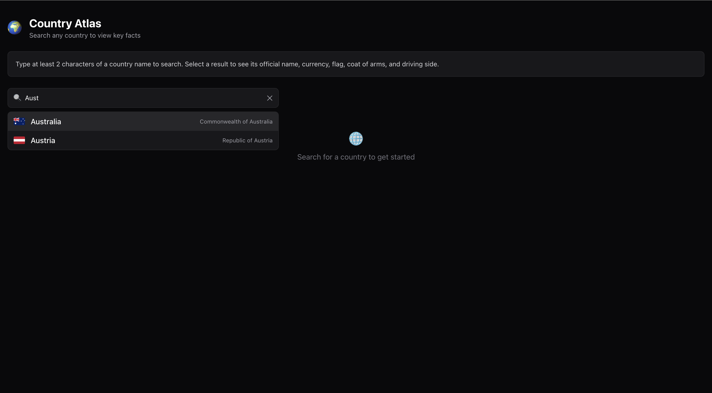
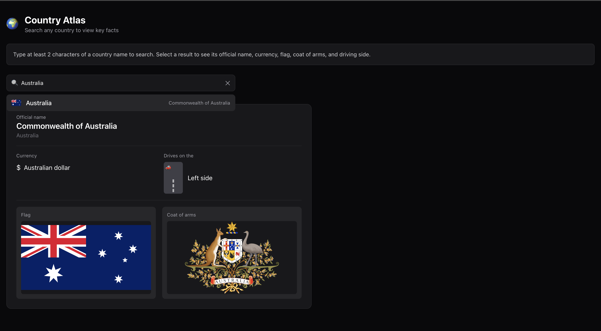
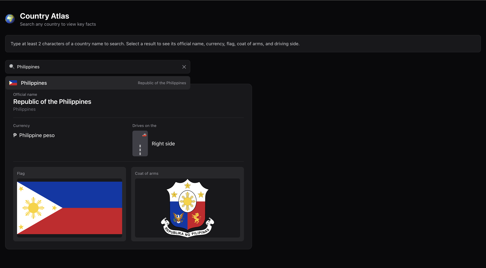

# Superloop FE Assessment

This is a single-page React application that helps you search and explore information about countries. It uses the [REST Countries API](https://restcountries.com/).

## Features

- You can search for countries in time and see the results in a dropdown list.

- When you select a country it shows you the following information:

The name of the country

The name and symbol of the countrys currency (it can have multiple currencies)

The countrys flag and coat of arms

Which side of the road people drive on in that country

- The layout is fully responsive. It looks good on any device.

- You can use your keyboard to navigate the search dropdown (use ↑ ↓. Escape).

- The application has markup, which makes it usable for everyone.

## Getting Started

### Prerequisites

- You need to have Node.js version 18 or higher installed.

- You also need to have npm or yarn installed.

### Installation

```bash

npm install

npm run dev

```

## Architecture

### Fetch strategy

The search function uses the REST Countries `/name/{query}` endpoint. It only requests the five fields that are shown in the UI:

```

GET https://restcountries.com/v3.1/name/{query}?fields=name,currencies,flags,coatOfArms,car

```

No data is fetched when the page loads. A network request is only made when you have typed least 2 characters and only after a short delay has passed. This helps keep network usage low.

### Rate limiting and request management

There are three mechanisms that work together to control API usage:

| Mechanism | Detail |

|---|---|

Minimum character threshold | It requires 2 or more characters before any request is made |

| Debounce | There is a 400 ms delay after the keystroke before fetching |

| AbortController | It cancels any request that is still being processed when a new query is made preventing responses from overwriting new results |

### Scaling considerations

This approach can be used with larger datasets. To scale to millions of records you can replace the REST Countries URL with your server-side search endpoint:

- Use server-side full-text search (like Postgres `tsvector` or Elasticsearch)

- Use paginated cursor-based responses

- The debounce, min-char threshold and AbortController logic on the client stays the same

## API Reference

All data comes from the public [REST Countries API](https://restcountries.com/). No authentication is required.

| Endpoint Usage |

|---|---|

| `GET /v3.1/name/{name}` | Search countries, by full or partial name |


# Results
## Searching

## Result(Aus)

##
